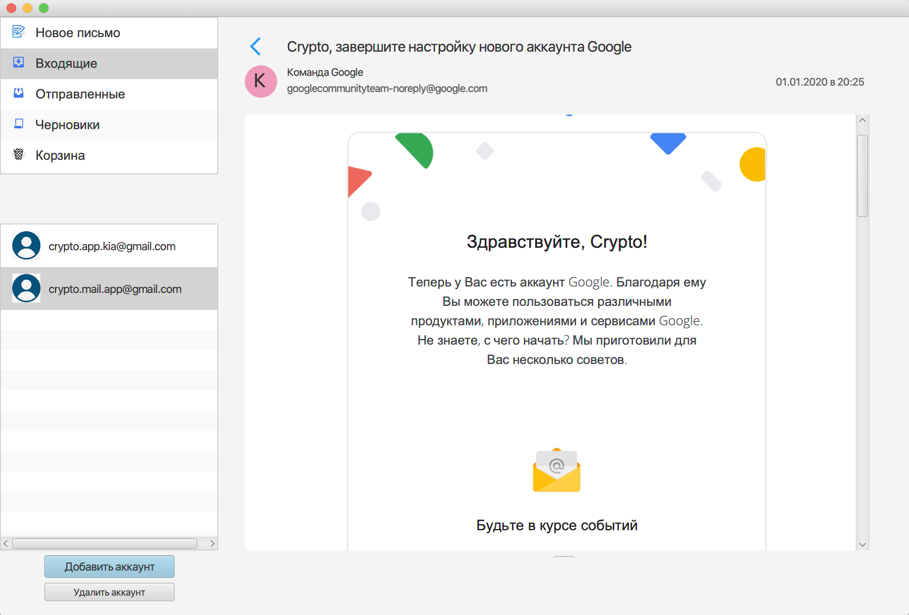
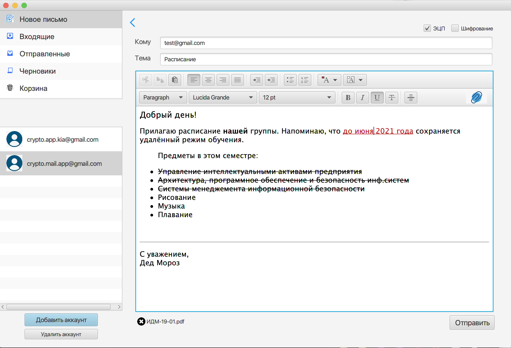
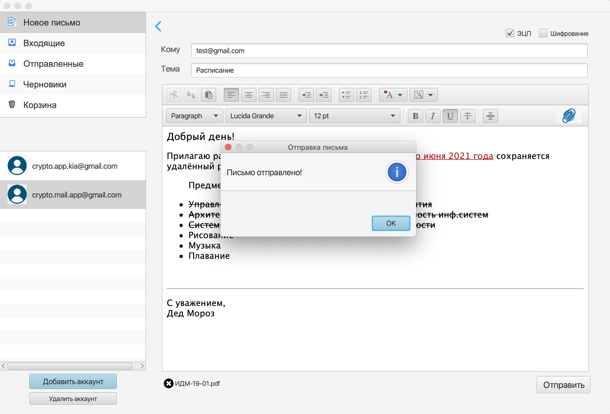
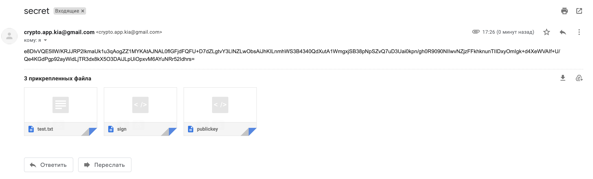
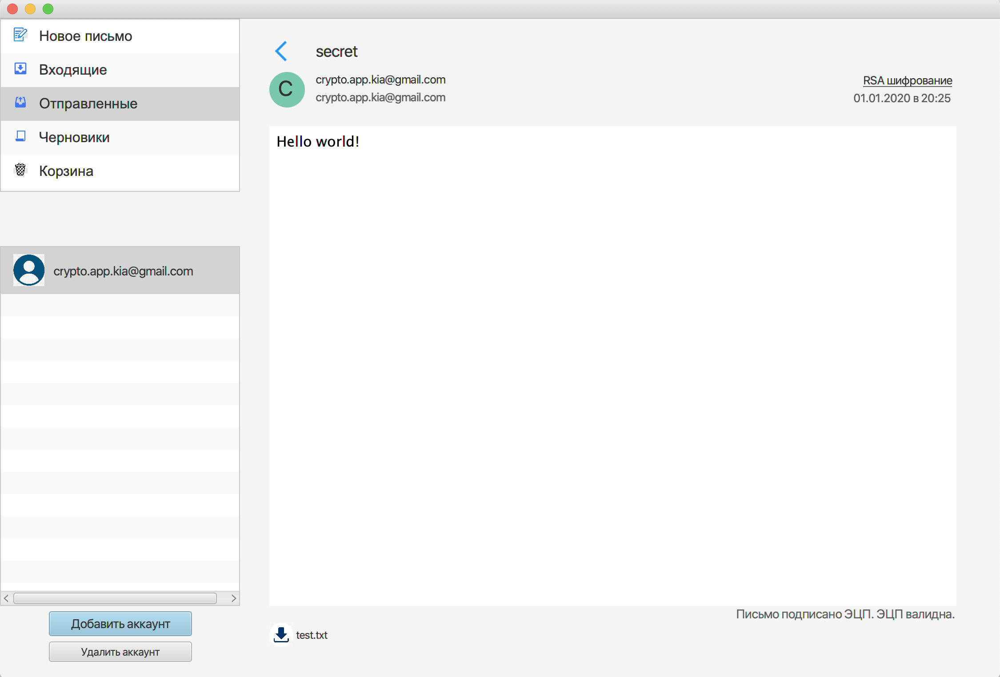

### MAIL-клиент.
Почтовый клиент с дополнительными возможностями подписи и шифрования сообщений.

--------------------------------
#### Шифрование и ЭЦП

Написание сообщения с подписью и шифрованием при отправке:

Зашифрованное сообщение с файлами для расшифровки и проверки подписи:

Расшифрованное сообщение с проверенной подписи:

